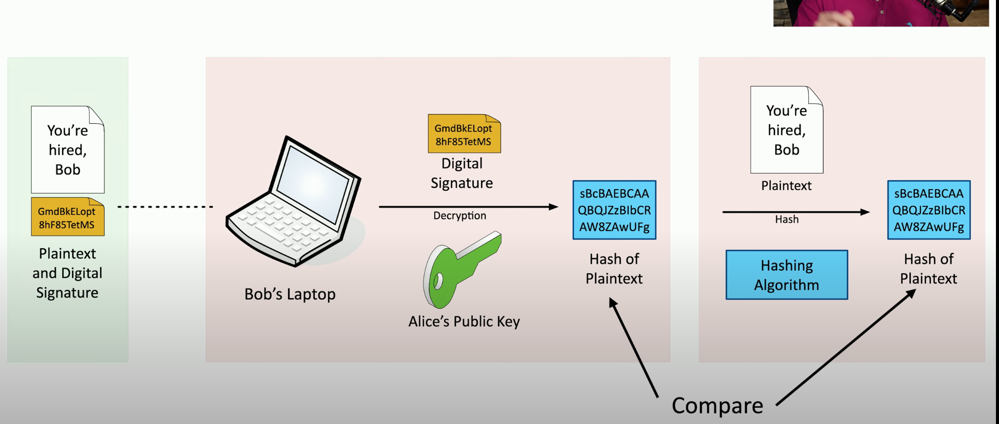

## 1.1 Compare and contrast various types of security controls
### Control Categories
Technical Controls
- Firewalls, anti-virus
Managerial controls
- Security policy
Operational Controls
- Security Guards
- Password training guide
Physical Controls
- Fences, locks
- Badge Readers

### Control Types
- Preventative
- Deterrent
	- Warning signs
- Detective
	- Identify if and when breach occurs
- Corrective
	- Applied after the event
	- Restore from backups after ransomware
- Compensating
	- Firewall blacks app until fixed
	- Generator used for power outage
- Directive
	- Require employees to store data in encrypted drive.
	- "Authorized Personal Only"

## 1.2 Summarize fundamental security concepts.
### The CIA Triad

Also, AIC triad.
#### Security Objectives
- Availability
- Integrity
- Confidentiality

Encryption and Authentication.

Hashing ensures that our data matches both ends.

Digital signature:
Encrypt the Hash.

### Non-repudiation
1. Proof of integrity
2. Proof of origin


(Get-FileHash .. -A SHA256).hash -eq "HASH#"


Integrity
- Prove the message has not changed
Authentication
- prove the source of the message
Non-repudiation
- Make sure the signature isn't fake
- Sign with a private key; paired with a public key.

### AAA framework
- Identification
- Authentication
- Authorization
- Accounting

#### CA (Certificate Authority)
- Manage certificates for devices and users
- *CA is a hashing and encryption algo?*

#### Authorization Model
The relationship of groups and users

### Gap Analysis
- Where we "are"
- Where we "want to go"
#### Determine end goal
- NIST Special Publication 800-171 R2
- ISO/IEC 27001

***NIST National Institute of Standards & Technology***
***ISO International Standards Organization***
#### GAP REPORT EXAMPLE

### Zero Trust
Authenticate each time you want to use a device, process, or user.
#### Planes of operation
- Split the network into functional planes
##### Data Plane
- process the frames, packets, and network data
- processing, forwarding, trunking, encrypting, NAT

***NAT Network Address Translation***
##### Control Plane
- Manages the actions of the data plane
- Define policies and rules
- Determines how packets should be forwarded
- Routing tables, session tables, NAT tables

**Policy-driven access control**

***PEP Policy Enforcement Point***
- Where/the physical device, that allows traffic to move forward based upon the policies of the organization.
- Gatekeeper
***PDP Policy Decision point***
- The actual machine with the rules.

### Physical Security
- Access Control Vestibules
- Barriers
- Keycard access doors

### Deception and Disruption
- Use a **honeypot** to keep them active and learn about the attackers
- **Honeynets** are when you build up entire faked networks (multiple honeypots)
- **Honeyfiles** are the fake files that appear top secret (passwords.csv) 
- **Honeytokens** are the fake credentials that verify the honeynet has been hit.

## 1.3 Explain the importance of change management processes and the impact to security.
### Change Management
- Upgrade software
	- set on a defined timeline
#### Change Approval Process
- What
- When
- Where
- Why

Stakeholders are usually the best choice for taking ownership of the change process.
#### Impact Analysis
- Risk of changing, or not changing
	- Low
	- Medium
	- High
Test in a sandbox environment.
- Create and Test backup process.

Covered in ***SOP (Standard Operating Procedue)***
### Technical Change Management
Allow List/Deny List
- Core tool for IT group controls

DOWNTIME is our responsibility.
1. Learn the legacy application and document it to become the core expert.
2. Ongoing documentation is a must!

Version Control allows us to maintain what app on what dependencies.

## 1.4 Explain the importance of using appropriate cryptographic solutions.
### Public Key Infrastructure
***PKI Public Key Infrastructure***
Digital certificates

#### Symmetric encryption
The same key is used for encryption and decryption
- Offers speed advantages
#### Asymmetric encryption
- Public key, private key (example bitcoin)
	- public can encrypt
	- private only can decrypt
		- ***PGP Pretty Good Privacy***
		- ***GPG Gnu Privacy Guard***
### Encrypting Data
Protected data on storage devices
- Data at rest
#### Transport Encryption
- HTTPS
- VPN, SSL
#### Encryption Algorithms
***DES Digital Encryption Standard***
- 5 steps
***AES Advanced Encryption Standard***
***AES-256 Advanced Encryption Standards 256-bit***
- 3 steps encryption first, with multiple level choice

Cryptography keys are hidden, but the algo is public knowledge.

#### Key stretching
nesting the encryption like Russian Dolls

### Key Exchange
- Out-of-Band key exchange
	- exchange outside of the internet
- in-band key exchange
	- exchange over the internet
	- Public key cryptography

### Encryption Technologies
#### TPM Trusted Platform Module
- cryptography and random number generation
#### HSM Hardware Security Module
- a TPM for an entire cluster of devices
- allows for faster encryption and decryption
- Pairs with a key manager software
#### Secure enclave
- a hardware processor that manages security of the system

### Obfuscation
Steganography
- hiding the text inside a .jpeg
Embedded messages in TCP packets
#### Tokenization
- Using a single use hash token from a credit card can go over the network openly, because it will only exist once.

#### Data masking
- hiding all but the last four of a credit card, or bank account number.

### Hashing and Digital Signatures
#### Hashes
- Represent data a short string of text.
	- A digital fingerprint
- Impossible to recover the original message form the digest
- Verify a downloaded document
- Digital signature
	- Authentication, non-repudiation, and integrity
#### SHA256
- 256 bits / as 64 hexadecimal characters
#### Collision
- where hashes match but original data does not.
- MD5 found in 1996 to have collision issues.
#### Practical hashing
- Verify a downloaded file


(Get-FileHash .. -A SHA256).hash -eq "HASH#"


- Password storage vault
	- Hash plus a salted hash
#### Salt
- random data based on each user
- **Rainbow Tables**
	- backwards engineers the hash table, when not salted.
#### Digital Signature
- private key to encrypt
- public key to decrypt
	- Can also work the other way around
#### Creating a digital signature

#### Verify signature

### Blockchain Technology
A Distributed Ledger
- Open Source ledger information.
- As long as no party gains 50% control, the blockchain remains immutable.

### Certificates
- A public key certificate
- A digital signature
	- PKI uses Certificate Authorities for additional trust.
		- ***PKI Public Key Infrastructure***
		- ***CA Certificate Authority***
- Certificate creation can be built into the OS
	- Windows Domain services
- **X.509**
	- standard website certificate
#### Root of Trust
- IT security requires trust
- The trusted source that we rely on (*e.g. MS Windows*)
- website CA when we visit the website.
#### Private Certificate Authorities
- for internal network software
	- Windows Certificate Services
	- [OpenCA](https://www.openca.org/projects/openca/)
- Internal CA process is same as an external CA
#### Wildcard Certificates
- `*.google.com`
	- the `*` means any subdomain would be valid under the certificate.
	- 
#### Key revocaiton
- ***CRL Certificate Revocation List***
	- a centralized way to revoke certificates across a network
	- Built into a CA

#### OCSP stapling
- ***OCSP Online Certificate Status Protocol***
	- provides scalability for OCSP checks
- the CA is responsible for responding to all OCSP requests 
- OCSP status is "stapled" into the SSL/TLS handshake.
	- ***SSL Secure Sockets Layer***
	- ***TLS Transport Layer Security***
- Most modern browsers support OCSP

## Resources:
[CompTIA Security+ Certificate Exam Objectives: SY0-701](https://partners.comptia.org/docs/default-source/resources/comptia-security-sy0-701-exam-objectives-(5-0))

[Professor Messer CompTIA Security+ SY0-701](https://www.youtube.com/watch?v=KiEptGbnEBc&list=PLG49S3nxzAnl4QDVqK-hOnoqcSKEIDDuv&index=1)

[Security+ 6.0 Acronym List](https://pbrazeale.github.io/Security+-6.0-Acronym-List/)
